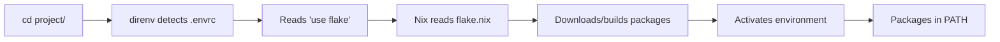

# Using direnv + Nix Flakes for Project Environments

## Overview

**direnv + Nix flakes** provides automatic, reproducible, project-specific development environments. When you `cd` into a project directory, the environment activates automatically with exact package versions specified in the flake.

### How It Works



**Key Benefits:**
- ✅ **Automatic activation** - No manual commands needed
- ✅ **Isolated environments** - Project-specific versions don't conflict
- ✅ **Reproducible** - Lock file ensures exact versions
- ✅ **Fast** - Packages cached in `/nix/store`, instant after first download
- ✅ **Cross-platform** - Same environment on macOS, Linux, NixOS

## Quick Start

### 1. Basic Project Setup

Create a project with Python 3.11 and Node.js 20:

```bash
mkdir ~/my-project && cd ~/my-project

# Create flake.nix
cat > flake.nix <<'EOF'
{
  description = "My Project Dev Environment";

  inputs = {
    nixpkgs.url = "github:NixOS/nixpkgs/nixos-unstable";
  };

  outputs = { self, nixpkgs }:
    let
      # System-specific packages
      forAllSystems = nixpkgs.lib.genAttrs [
        "aarch64-darwin"  # Apple Silicon
        "x86_64-darwin"   # Intel macOS
        "x86_64-linux"    # Linux
        "aarch64-linux"   # ARM Linux
      ];
    in {
      devShells = forAllSystems (system:
        let
          pkgs = nixpkgs.legacyPackages.${system};
        in {
          default = pkgs.mkShell {
            buildInputs = with pkgs; [
              python311
              nodejs_20
            ];

            shellHook = ''
              echo "🚀 Development environment loaded!"
              echo "  Python: $(python --version)"
              echo "  Node:   $(node --version)"
            '';
          };
        }
      );
    };
}
EOF

# Create .envrc
echo "use flake" > .envrc

# Allow direnv to load the environment
direnv allow

# ✨ That's it! Environment is now active
python --version  # Python 3.11.x
node --version    # v20.x.x
```

### 2. Lock File for Reproducibility

First time you run `direnv allow`, Nix creates `flake.lock`:

```bash
# Lock file is created automatically
git add flake.nix flake.lock .envrc

# Commit these files
git commit -m "Add Nix flake for dev environment"
```

**The lock file ensures:**
- Same package versions for all team members
- Reproducible builds across machines
- No surprise updates

### 3. Updating Dependencies

```bash
# Update all dependencies
nix flake update

# Update specific input
nix flake update nixpkgs

# Then reload
direnv reload
```

## Common Use Cases

### Python Project

**Scenario:** Python 3.11 with specific packages

```nix
{
  description = "Python Project";
  inputs.nixpkgs.url = "github:NixOS/nixpkgs/nixos-unstable";

  outputs = { nixpkgs, ... }:
    let
      forAllSystems = nixpkgs.lib.genAttrs [
        "aarch64-darwin" "x86_64-darwin" "x86_64-linux" "aarch64-linux"
      ];
    in {
      devShells = forAllSystems (system:
        let
          pkgs = nixpkgs.legacyPackages.${system};
        in {
          default = pkgs.mkShell {
            buildInputs = with pkgs; [
              python311
              python311Packages.pip
              python311Packages.virtualenv
              python311Packages.pytest
              poetry  # or pipenv
            ];

            shellHook = ''
              # Create venv if it doesn't exist
              if [ ! -d .venv ]; then
                python -m venv .venv
              fi
              source .venv/bin/activate

              # Install dependencies
              if [ -f requirements.txt ]; then
                pip install -r requirements.txt
              fi
            '';
          };
        }
      );
    };
}
```

### Ruby on Rails Project

**Scenario:** Ruby 3.2 with Rails and PostgreSQL

```nix
{
  description = "Rails Project";
  inputs.nixpkgs.url = "github:NixOS/nixpkgs/nixos-unstable";

  outputs = { nixpkgs, ... }:
    let
      forAllSystems = nixpkgs.lib.genAttrs [
        "aarch64-darwin" "x86_64-darwin" "x86_64-linux" "aarch64-linux"
      ];
    in {
      devShells = forAllSystems (system:
        let
          pkgs = nixpkgs.legacyPackages.${system};
        in {
          default = pkgs.mkShell {
            buildInputs = with pkgs; [
              ruby_3_2
              bundler
              postgresql_16
              nodejs_20  # For asset pipeline
              yarn
            ];

            shellHook = ''
              export PGDATA="$PWD/.postgres"

              # Initialize PostgreSQL if needed
              if [ ! -d "$PGDATA" ]; then
                initdb -D "$PGDATA"
                echo "unix_socket_directories = '$PWD/.postgres'" >> "$PGDATA/postgresql.conf"
              fi

              # Start PostgreSQL
              pg_ctl -D "$PGDATA" -l "$PGDATA/logfile" start

              # Install gems
              bundle install

              echo "✅ Rails environment ready!"
              echo "   PostgreSQL running at: $PWD/.postgres"
            '';
          };
        }
      );
    };
}
```

### Node.js Monorepo

**Scenario:** Node 20 with pnpm for monorepo

```nix
{
  description = "Node.js Monorepo";
  inputs.nixpkgs.url = "github:NixOS/nixpkgs/nixos-unstable";

  outputs = { nixpkgs, ... }:
    let
      forAllSystems = nixpkgs.lib.genAttrs [
        "aarch64-darwin" "x86_64-darwin" "x86_64-linux" "aarch64-linux"
      ];
    in {
      devShells = forAllSystems (system:
        let
          pkgs = nixpkgs.legacyPackages.${system};
        in {
          default = pkgs.mkShell {
            buildInputs = with pkgs; [
              nodejs_20
              nodePackages.pnpm
              nodePackages.typescript
              nodePackages.eslint
              nodePackages.prettier
            ];

            shellHook = ''
              # Auto-install dependencies
              if [ -f pnpm-lock.yaml ]; then
                pnpm install
              fi

              echo "📦 Node.js monorepo environment loaded"
            '';
          };
        }
      );
    };
}
```

### Go + Kubernetes Project

**Scenario:** Go with kubectl, helm, k9s

```nix
{
  description = "Go + K8s Project";
  inputs.nixpkgs.url = "github:NixOS/nixpkgs/nixos-unstable";

  outputs = { nixpkgs, ... }:
    let
      forAllSystems = nixpkgs.lib.genAttrs [
        "aarch64-darwin" "x86_64-darwin" "x86_64-linux" "aarch64-linux"
      ];
    in {
      devShells = forAllSystems (system:
        let
          pkgs = nixpkgs.legacyPackages.${system};
        in {
          default = pkgs.mkShell {
            buildInputs = with pkgs; [
              go_1_22
              gopls
              golangci-lint
              kubectl
              kubernetes-helm
              k9s
              kustomize
            ];

            shellHook = ''
              export GOPATH="$PWD/.go"
              export PATH="$GOPATH/bin:$PATH"

              echo "🐹 Go + K8s environment ready!"
            '';
          };
        }
      );
    };
}
```

### Multi-Language Full-Stack

**Scenario:** Python backend + Node frontend + PostgreSQL + Redis

```nix
{
  description = "Full-Stack Project";
  inputs.nixpkgs.url = "github:NixOS/nixpkgs/nixos-unstable";

  outputs = { nixpkgs, ... }:
    let
      forAllSystems = nixpkgs.lib.genAttrs [
        "aarch64-darwin" "x86_64-darwin" "x86_64-linux" "aarch64-linux"
      ];
    in {
      devShells = forAllSystems (system:
        let
          pkgs = nixpkgs.legacyPackages.${system};
        in {
          default = pkgs.mkShell {
            buildInputs = with pkgs; [
              # Backend
              python311
              poetry

              # Frontend
              nodejs_20
              nodePackages.pnpm

              # Databases
              postgresql_16
              redis

              # Tools
              docker-client
              docker-compose
            ];

            shellHook = ''
              echo "🚀 Full-stack environment loaded!"
              echo ""
              echo "Backend (Python):"
              echo "  cd backend && poetry install"
              echo ""
              echo "Frontend (Node):"
              echo "  cd frontend && pnpm install"
              echo ""
              echo "Services:"
              echo "  docker-compose up -d"
            '';
          };
        }
      );
    };
}
```

## Advanced Patterns

### Using Specific Package Versions

**Pin exact nixpkgs version for Python 3.10:**

```nix
{
  description = "Python 3.10 Project";

  inputs = {
    # Pin to specific nixpkgs revision with Python 3.10
    nixpkgs.url = "github:NixOS/nixpkgs/a3ed7406349a9335cb4c2a71369b697cecd9d351";
  };

  outputs = { nixpkgs, ... }:
    let
      forAllSystems = nixpkgs.lib.genAttrs [
        "aarch64-darwin" "x86_64-darwin" "x86_64-linux"
      ];
    in {
      devShells = forAllSystems (system:
        let
          pkgs = nixpkgs.legacyPackages.${system};
        in {
          default = pkgs.mkShell {
            buildInputs = [ pkgs.python310 ];
          };
        }
      );
    };
}
```

**Find nixpkgs revision with specific version:**
```bash
# Search for package versions
nix search nixpkgs python310

# Find exact commit with version you need
# Visit: https://lazamar.co.uk/nix-versions/
```

### Environment Variables

**Set project-specific environment variables:**

```nix
{
  # ... inputs ...

  outputs = { nixpkgs, ... }:
    let
      forAllSystems = nixpkgs.lib.genAttrs [ "aarch64-darwin" "x86_64-linux" ];
    in {
      devShells = forAllSystems (system:
        let
          pkgs = nixpkgs.legacyPackages.${system};
        in {
          default = pkgs.mkShell {
            buildInputs = with pkgs; [ nodejs_20 postgresql ];

            # Environment variables
            DATABASE_URL = "postgresql://localhost/mydb";
            API_KEY = "dev-key-123";
            NODE_ENV = "development";

            shellHook = ''
              echo "Environment loaded with:"
              echo "  DATABASE_URL=$DATABASE_URL"
              echo "  NODE_ENV=$NODE_ENV"
            '';
          };
        }
      );
    };
}
```

### Multiple Dev Shells

**Different environments in one flake:**

```nix
{
  description = "Multi-environment project";
  inputs.nixpkgs.url = "github:NixOS/nixpkgs/nixos-unstable";

  outputs = { nixpkgs, ... }:
    let
      forAllSystems = nixpkgs.lib.genAttrs [ "aarch64-darwin" "x86_64-linux" ];
    in {
      devShells = forAllSystems (system:
        let
          pkgs = nixpkgs.legacyPackages.${system};
        in {
          # Default environment
          default = pkgs.mkShell {
            buildInputs = with pkgs; [ nodejs_20 ];
          };

          # Python environment
          python = pkgs.mkShell {
            buildInputs = with pkgs; [ python311 poetry ];
          };

          # Go environment
          go = pkgs.mkShell {
            buildInputs = with pkgs; [ go gopls ];
          };
        }
      );
    };
}
```

**Use specific shell:**
```bash
# In .envrc
use flake .#python  # Use python shell

# Or manually
nix develop .#go  # Enter go shell
```

### Overlays for Custom Packages

**Override or add custom packages:**

```nix
{
  description = "Project with custom package";
  inputs.nixpkgs.url = "github:NixOS/nixpkgs/nixos-unstable";

  outputs = { nixpkgs, ... }:
    let
      forAllSystems = nixpkgs.lib.genAttrs [ "aarch64-darwin" "x86_64-linux" ];
    in {
      devShells = forAllSystems (system:
        let
          pkgs = import nixpkgs {
            inherit system;
            overlays = [
              (final: prev: {
                # Custom node version
                nodejs = prev.nodejs_20;

                # Or build from source
                myCustomTool = prev.buildGoModule {
                  pname = "my-tool";
                  version = "1.0.0";
                  src = ./tools/my-tool;
                  vendorHash = "sha256-...";
                };
              })
            ];
          };
        in {
          default = pkgs.mkShell {
            buildInputs = with pkgs; [ nodejs myCustomTool ];
          };
        }
      );
    };
}
```

## direnv Commands

### Essential Commands

```bash
# Allow direnv to load .envrc (required first time)
direnv allow

# Block direnv in current directory
direnv deny

# Reload environment (after changing flake.nix)
direnv reload

# Check environment status
direnv status

# Show what direnv would do
direnv show_dump
```

### .envrc Options

**Basic usage:**
```bash
# .envrc
use flake
```

**With specific shell:**
```bash
# .envrc
use flake .#python
```

**With logging:**
```bash
# .envrc
use flake --impure  # Allow impure evaluation
```

**Load additional env file:**
```bash
# .envrc
use flake
dotenv .env.local  # Load local env vars
```

## Best Practices

### 1. Commit Lock File

**Always commit `flake.lock`:**
```bash
git add flake.nix flake.lock .envrc
git commit -m "Add Nix development environment"
```

**Why:** Ensures team members get exact same package versions.

### 2. .envrc in .gitignore?

**No!** Commit `.envrc` so direnv activates automatically for team:
```bash
# Good - in git
.envrc

# Optional - gitignore for secrets
.envrc.local  # Personal overrides
```

### 3. Use shellHook for Setup

**Automate repetitive tasks:**
```nix
shellHook = ''
  # Install dependencies
  [ -f package.json ] && npm install

  # Setup database
  [ ! -d .postgres ] && initdb -D .postgres

  # Run migrations
  [ -f db/migrate ] && rails db:migrate

  echo "✅ Ready to code!"
'';
```

### 4. Document in README

**Help team members:**
```markdown
## Development Setup

This project uses Nix + direnv for reproducible environments.

### Prerequisites
- Install Nix: https://nixos.org/download.html
- Install direnv: https://direnv.net/docs/installation.html

### Setup
1. Clone repo: `git clone ...`
2. Enter directory: `cd project`
3. Allow direnv: `direnv allow`
4. ✨ Environment loads automatically!

### Daily Use
- Environment activates when you `cd` into project
- Update deps: `nix flake update`
- Reload: `direnv reload`
```

### 5. Keep flake.nix Simple

**Start minimal, add as needed:**
```nix
{
  description = "My Project";
  inputs.nixpkgs.url = "github:NixOS/nixpkgs/nixos-unstable";

  outputs = { nixpkgs, ... }:
    let
      forAllSystems = nixpkgs.lib.genAttrs [ "aarch64-darwin" "x86_64-linux" ];
    in {
      devShells = forAllSystems (system: {
        default = nixpkgs.legacyPackages.${system}.mkShell {
          buildInputs = with nixpkgs.legacyPackages.${system}; [
            # Add only what you need
            nodejs
            python3
          ];
        };
      });
    };
}
```

## Troubleshooting

### direnv not activating

**Symptom:** Nothing happens when entering directory

**Fix:**
```bash
# Check if direnv is hooked into shell
direnv status

# If not, add to ~/.zshrc (already done in our Nix config):
eval "$(direnv hook zsh)"

# Allow the directory
direnv allow
```

### "use: command not found"

**Symptom:** `.envrc` shows error about `use flake`

**Fix:**
```bash
# Install nix-direnv (already in development.nix)
nix-env -iA nixpkgs.nix-direnv

# Or ensure it's enabled in Nix config (already done):
programs.direnv.nix-direnv.enable = true;
```

### Packages not in PATH

**Symptom:** `command not found` even though in `buildInputs`

**Fix:**
```bash
# Reload direnv
direnv reload

# Check what's loaded
echo $PATH

# Verify package is in shell
nix develop --command which python
```

### Slow activation

**Symptom:** Takes long time to activate environment

**Possible causes:**
1. **First time** - Nix downloading packages (normal)
2. **Large flake** - Too many inputs

**Fix for large flakes:**
```nix
# Use binary cache
nix.settings = {
  substituters = [
    "https://cache.nixos.org"
    "https://nix-community.cachix.org"
  ];
};

# Or use --offline after first load
# .envrc
use flake --offline
```

### Lock file conflicts

**Symptom:** Merge conflicts in `flake.lock`

**Fix:**
```bash
# Accept one version
git checkout --theirs flake.lock  # or --ours

# Regenerate lock
nix flake update

# Commit
git add flake.lock
git commit
```

### Environment variables not set

**Symptom:** Variables in flake.nix not available

**Fix:**
```nix
# Method 1: Use shellHook
shellHook = ''
  export MY_VAR="value"
'';

# Method 2: Set in mkShell directly
{
  MY_VAR = "value";  # Works in nix develop
}

# Method 3: Use .envrc (for secrets)
# .envrc
use flake
export SECRET_KEY="..."
```

## Migration from mise

### Step 1: Identify Versions

```bash
# Check current mise versions
mise list

# Example output:
# python  3.11.9
# nodejs  20.5.0
# ruby    3.2.2
```

### Step 2: Create flake.nix

```nix
{
  description = "Migrated from mise";
  inputs.nixpkgs.url = "github:NixOS/nixpkgs/nixos-unstable";

  outputs = { nixpkgs, ... }:
    let
      forAllSystems = nixpkgs.lib.genAttrs [ "aarch64-darwin" "x86_64-linux" ];
    in {
      devShells = forAllSystems (system:
        let
          pkgs = nixpkgs.legacyPackages.${system};
        in {
          default = pkgs.mkShell {
            buildInputs = with pkgs; [
              python311     # mise: python  3.11.9
              nodejs_20     # mise: nodejs  20.5.0
              ruby_3_2      # mise: ruby    3.2.2
            ];
          };
        }
      );
    };
}
```

### Step 3: Test

```bash
# Create .envrc
echo "use flake" > .envrc
direnv allow

# Verify versions match
python --version
node --version
ruby --version
```

### Step 4: Remove mise

```bash
# Remove .tool-versions
rm .tool-versions

# Uninstall mise (optional - keep for other projects)
brew uninstall mise

# Clean up mise data
rm -rf ~/.local/share/mise
rm -rf ~/.cache/mise
```

## Resources

- **Nix Flakes Manual:** https://nixos.org/manual/nix/stable/command-ref/new-cli/nix3-flake.html
- **direnv Documentation:** https://direnv.net/
- **Package Search:** https://search.nixos.org/packages
- **Version Finder:** https://lazamar.co.uk/nix-versions/
- **Nix Pills (Learning):** https://nixos.org/guides/nix-pills/
- **Our Architecture Docs:** `docs/ARCHITECTURE.md`
- **Project Versions Guide:** `docs/PROJECT_VERSIONS.md`

---

*Last Updated: 2025-10-08 - Initial direnv + flakes documentation*
